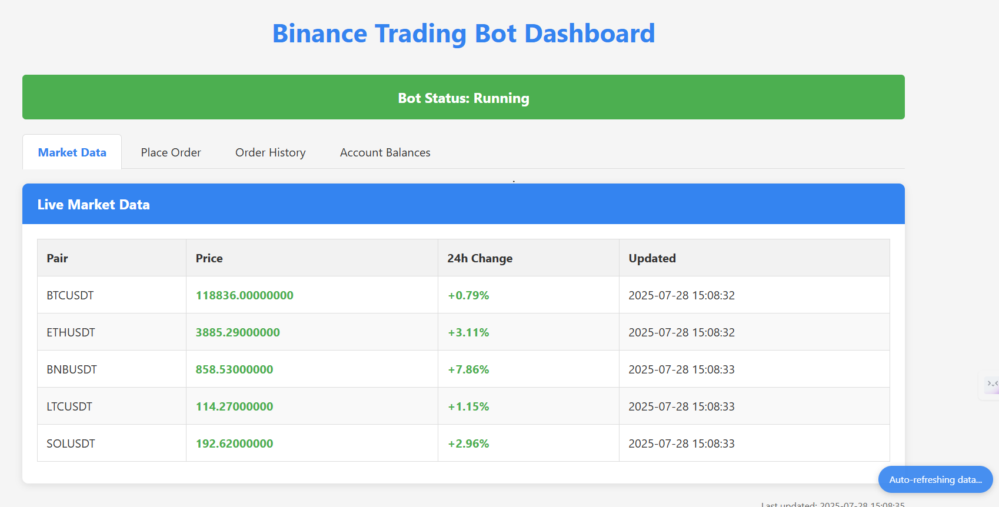
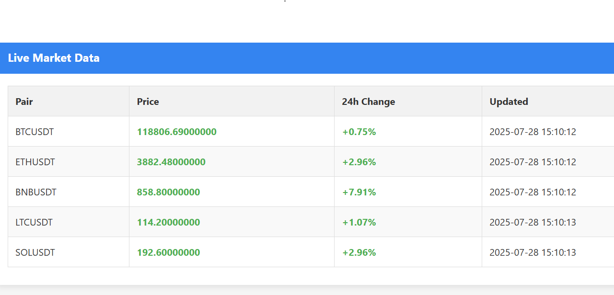
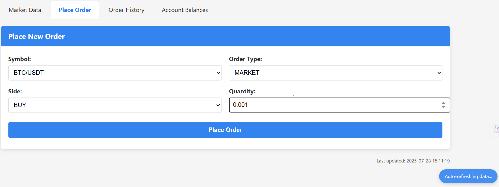
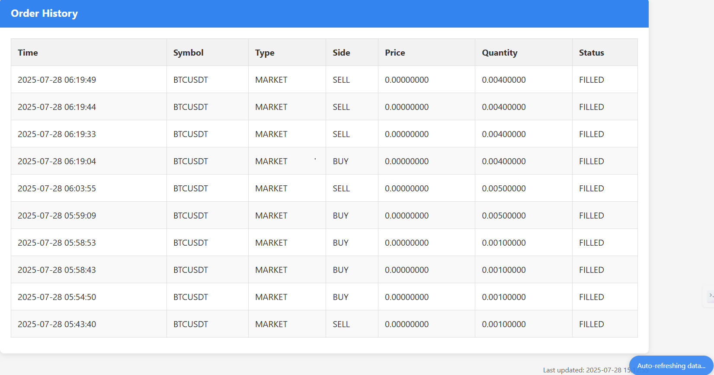
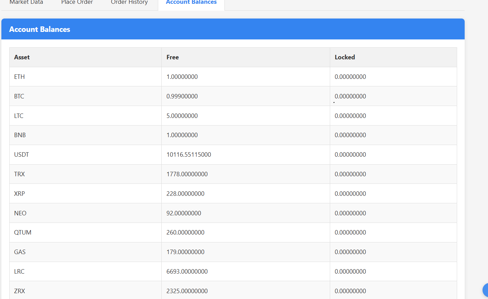
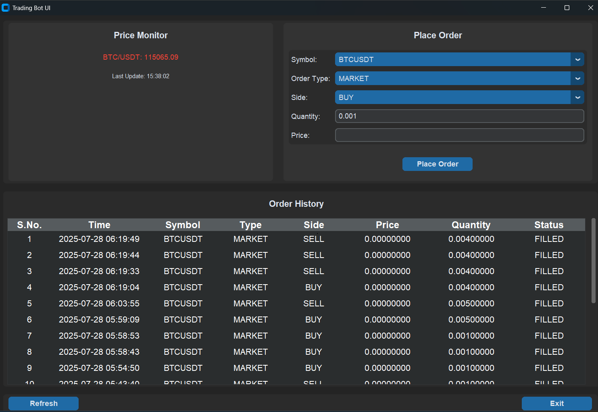

# Binance Futures Trading Bot - Hiring Assessment

**Note:** This project was developed as a technical assessment for a hiring process, with a completion timeframe of approximately 24-48 hours.

---

## Overview

This is a functional trading bot for the Binance Futures Testnet, complete with a user-friendly graphical interface (GUI). The application allows users to monitor cryptocurrency prices in real-time, place `MARKET` and `LIMIT` orders, and view their order history.

The project emphasizes a clean architecture, robust error handling, and a polished user experience.

## Features

- Real-time price monitoring with color-coded price changes
- Market and limit order placement
- Order history tracking
- Account balance monitoring
- Interactive GUI built with CustomTkinter (desktop) and Flask (web)
- Testnet support for risk-free testing
- Comprehensive error handling

## Desktop UI

The desktop interface provides a full-featured trading experience:
- Live price updates with visual indicators
- Order placement forms
- Detailed order history with custom styling
- Custom notifications

## Web UI

The trading bot includes a web interface for remote monitoring and trading:

- Start the web UI: `python web_ui.py`
- Access the interface at http://localhost:8080
- For remote access, deploy to a web server or Azure VM

### Features
- Live market data with price change indicators
- Order placement for both market and limit orders
- Order history tracking
- Account balance monitoring
- Mobile-friendly responsive design

## Setup and Installation

1. **Clone the Repository:**
   ```bash
   git clone https://github.com/ALOK-Yeager/Binance-Trading-Bot-GUI.git
   cd Binance-Trading-Bot-GUI
   ```

2. **Install Dependencies:**
   Make sure you have Python 3 installed. Then, install the required packages using pip:
   ```bash
   pip install -r requirements.txt
   ```

3. **Configure API Keys:**
   - Create a file named `.env` in the root of the project directory.
   - Add your Binance Testnet API key and secret to this file:
     ```env
     BINANCE_API_KEY=your_testnet_api_key
     BINANCE_API_SECRET=your_testnet_api_secret
     ```
   - You can obtain testnet keys from [Binance Futures Testnet](https://testnet.binancefuture.com/).

## How to Run the Bot

### Desktop Mode
To start the trading interface with full GUI features, run the `trading_ui.py` script from the root directory:

```bash
python trading_ui.py
```

### Headless Mode
For server deployment without GUI (ideal for cloud servers):

```bash
python headless_bot.py
```

### Web Interface
To access the bot via a web browser interface:

```bash
python web_ui.py
```
Then navigate to `http://localhost:8080` in your web browser (or substitute with your server's IP address).

## Running the Tests

The project includes a full suite of unit tests for the core bot logic to ensure its reliability.

To run the tests, execute the following command from the root directory:

```bash
python -m pytest
```

This command will automatically discover and run all tests located in the `tests/` directory.

## Project Structure

```
TradingBot_Python/
├── src/
│   └── bot.py             # Core trading logic
├── tests/
│   └── test_bot.py        # Unit tests for the bot
├── logs/                  # For storing log files (if implemented)
├── .env                   # Stores API keys (must be created manually)
├── trading_ui.py          # Desktop GUI application
├── headless_bot.py        # Background trading bot (no GUI)
├── web_ui.py              # Web interface for remote monitoring
├── systemd/               # Service files for Linux deployment
├── requirements.txt       # Project dependencies
└── README.md              # This file
```

## Screenshots

### Web UI Interface

The web interface provides a modern, responsive design accessible from any browser:

#### Dashboard Overview

*The main dashboard shows the bot status, current market prices with color-coded indicators for price changes, and provides navigation tabs to other sections.*

#### Market Monitoring

*Real-time market data with color-coded price changes helps traders quickly identify market trends and opportunities.*

#### Order Placement

*The order placement interface allows users to easily create market or limit orders with a simple, intuitive form that adapts based on order type.*

#### Order History

*View your complete order history with detailed information about each transaction, including time, symbol, price, quantity, and status.*

#### Account Balances

*Monitor your account balances across multiple assets with a clear, easy-to-read table showing both free and locked amounts.*

### Desktop UI Interface

The desktop application provides a feature-rich trading experience:

#### Trading Dashboard Overview

*The unified interface brings together comprehensive trading tools, real-time price alerts, and advanced order types into a single, powerful dashboard. Experience seamless charting, customizable alerts, and sophisticated trading strategies—all in one view.*


